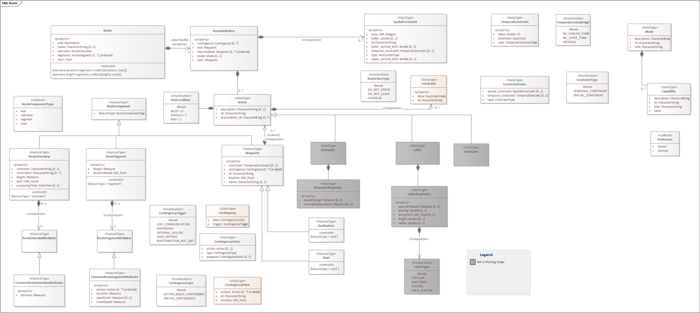

== Overview of the Route model

=== Scenarios

The Route model is driven by three routing scenarios. These were:

* Online - fully connected with stability
* Intermittent - unreliable connection
* Offline - no connectivity

==== Online scenario
In the Online scenario, an operator uses a routing client to request a route from a Routing API provider, which in turn retrieves the route from an online routing engine. In this scenario all components have consistent connections between them and out to the wider internet.

This scenario uses OGC API Routes for all request and response handling between the client and the routing infrastructure.

==== Intermittent scenario
The intermittent scenario is where the components have connectivity, but it is not necessarily consistent, stable, reliable, or high-speed.

Therefore, the network cannot be relied upon to provide connectivity on demand and compensation actions are likely when connectivity is not available. Intermittent connectivity is unpredictable and it maybe that in the real-world, decisions are made to treat intermittent connectivity as no connectivity, as it is the only sensible course of action, especially if the scenario involves threat to life.

For example, only one of the clients had access to a routing engine. Therefore, the connected client had the ability to create routes, but other clients cannot. If the clients are able to communicate with each other via some other means (Bluetooth or some other peer-to-peer communication, for example), the clients could still share pre-defined routes, that is, the routing operation has been completed when a connection to the routing engine was established, but has now been lost. 

Another approach to support in particular low-bandwidth situations is to not transmit the complete route definition to the client, but to return route information segment by segment as the vehicle moves along the route. This approach is not supported by this standard and might be added in a future extension or revision.

==== Offline scenario
The Offline scenario assumes that there is no connectivity outside of a device’s local network, this could be a desktop computer, mobile device or a mesh. In the real-world the scenario is modeling an instance where there is no connectivity and there is not going to be any connectivity for the duration of an operation. 

An operator uses the routing functionality provided by the client to create a route. The operator then shares this route with other local clients using the route exchange model. To enable the required functionality, all of the capability has to be tightly coupled in a single location. Practically, this involves installing all of the components on the same machine to remove communication dependencies with the wider network.

=== The Route model

[#rem-classes]
.UML class diagram of the Route model

==== Action
* a `Data type`
* attribute `description`
** multiplicity: 0..1
** value: `CharacterString`
* attribute `id`
** multiplicity: 1
** value: `CharacterString`

==== Destination
* a subtype of `Waypoint`
* a `Feature`
* constraints:
** `type = 'end'`

==== Mode
* a `Data type`
* attribute `description`
** multiplicity: 0..1
** value: `CharacterString`
* attribute `id`
** multiplicity: 1
** value: `CharacterString`
* attribute `title`
** multiplicity: 1
** value: `CharacterString`

==== Route
* an `Object` 
* association role `describedBy`
** multiplicity: 1
** value: `RouteDefinition`
* attribute `end`
** definition: The end point of the route.
** multiplicity: 1
** value: `Destination`
* attribute `name`
** definition: Title of the route.
** multiplicity: 0..1
** value: `CharacterString`
* attribute `overview`
** multiplicity: 1
** value: `RouteOverview`
* attribute `segments`
** multiplicity: 1..*
** value: `RouteSegment`
 * attribute `start`
** definition: The start point of the route.
** multiplicity: 1
** value: `Start`
* constraints:
** `overview.duration=segments->collect(duration)->sum()`
** `overview.length=segments->collect(length)->sum()`

==== RouteComponent
* a supertype of `RouteOverview`, `RouteSegment`, `Waypoint`
* a `Feature`
* is abstract
* attribute `type`
** multiplicity: 1
** values:
*** `start`
*** `end` 
*** `overview` 
*** `segment`

==== RouteDefinition
* a `Object`
* definition: Information about the definition of the route. At a minimum, a route is defined by two waypoints, the start and end point of the route.
* attribute `end`
** multiplicity: 1
** value: `Waypoint`
* attribute `intermediate`
** definition: Additional waypoints along the route between start and end to consider when computing the route.
** multiplicity: 0..*
** value: `Waypoint`
* attribute `mode`
** definition: A configurable setting that determines the operational profile and planning parameters for a vehicle’s plan.
** multiplicity: 0..1
** value: `Mode`
* attribute `preference`
** definition: The optimization goal for the route calculation (fastest, shortest, etc.). 
** multiplicity: 1
** default: `fastest`
** values:
*** `fastest`
*** `shortest`
*** ...
* attribute `start`
** multiplicity: 1
** value: `Waypoint`

==== RouteOverview
* a subtype of `RouteComponent`
* a `Feature`
* attribute `comment`
** definition: Explains any minor issues that were encountered during the processing of the routing request, i.e. any issues that did not result in an error.
** multiplicity: 0..1
** value: `CharacterString`
* attribute `duration`
** definition: Estimated amount of time required to travel the route in seconds.
** multiplicity: 0..1
** value: `Measure`
* attribute `length`
** definition: Length of the route in meters.
** multiplicity: 1
** value: `Measure`
* attribute `path`
** definition: The path from the start point to the end point of the route.
** multiplicity: 1
** value: `GM_Curve`
* attribute `processingTime`
** definition: The time when the route was calculated.
** multiplicity: 0..1
** value: `DateTime`
* constraints:
** `type = 'overview'`

==== RouteSegment
* a subtype of `RouteComponent`
* a `Feature`
* attribute `length`
** definition: Length of the segment in meters.
** multiplicity: 1
** value: `Measure`
* attribute `locationAtEnd`
** definition: The last position of the segment and be on the path geometry of the route overview.
** multiplicity: 1
** value: `GM_Point`
* constraints:
** `type = 'segment'`

==== Start
* a subtype of `Waypoint`
* a `Feature`
* constraints:
** `type = 'start'`

==== Waypoint
* a subtype of `RouteComponent`
* a supertype of `Destination`, `Start`
* a `Feature`
* definition: A waypoint of the route.
* attribute `action`
** definition: A predefined operation, task, or activity assigned to a specific waypoint along a route, to be performed when reaching or interacting with that location.
** multiplicity: 0..*
** value: `Action`
* attribute `id`
** definition: The id of the waypoint.
** multiplicity: 1
** value: `CharacterString`
* attribute `location`
** definition: The coordinates of the waypoint.
** multiplicity: 1
** value: `GM_Point`
* attribute `name`
** definition: A name for the waypoint.
** multiplicity: 0..1
** value: `CharacterString`

=== Alignment with other standards

Other standards, such as General Transit Feed Specification (GTFS) or Network Timetable Exchange (NeTEx), use relatively similar concepts of routes than the Route Exchange Model, but for the purposes of modelling transit networks. As such, they put a higher emphasis in timetables and fares of regular transport lines and lower in the geographical components of routes.

Even though public transport routes can be partially modelled using Route Exchange Model, it is out of scope and not all the necessary characteristics are supported by this standard. Future extensions or revisions might expand the scope to support them fully.
